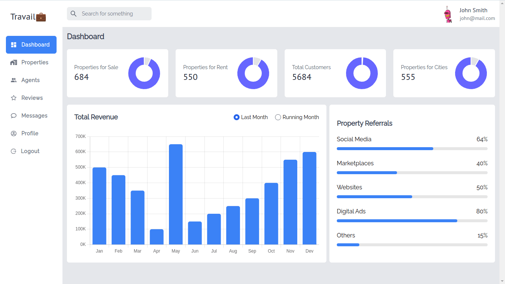

# Travail🏠

Travail is a web platform that facilitates buying, selling, and renting houses. It provides a user-friendly interface for users to explore listings, contact agents, and for admin or agents to manage their properties.

<div></div>

## Requirements

- [Node.js](https://nodejs.org/) - JavaScript Runtime
- [Svelte](https://svelte.dev/) - JavaScript framework
- [SvelteKit](https://kit.svelte.dev/) - JavaScript Metaframework built with Svelte
- [DrizzleORM](https://orm.drizzle.team/) - TypeScript ORM
- [UnoCSS](https://unocss.dev/) or [TailwindCSS](https://www.tailwindcss.com/) - CSS frameworks
- [Zod](https://zod.dev/) - TypeScript validation library

<!-- - [Vitest](https://vitest.dev/) - Testing framework -->

## Tools/Frameworks Used

- **Frontend:**

  - Svelte
  - UnoCSS
  - Chart.js
  - Zod

- **Backend:**
  - SvelteKit
  - DrizzleORM
  - SQLite
  - Argon2 (password hashing)

## Getting Started

Follow these steps to set up and run the Travail project locally:

### 1. Clone the Repository

```bash
git clone https://github.com/sparrowsl/travail.git
cd travail
```

### 2. Install Dependencies

```bash
npm install
```

### 3. Configure Environment Variables

Create a `.env` file in the root directory and set the following variables:

```env
DATABASE_URL="./database.db"
JWT_SECRET_KEY="superdumblongsecretkey"
```

Adjust the values according to your environment.

### 4. Setup database tables

```bash
npm run db:push
```

run `npm run db:studio` to add data manually in the database _(use for creating new admin only)_

### 5. Run the Application

```bash
npm run dev
```

Visit `http://localhost:5173` in your browser to see the Travail in action.

## Contributing

Feel free to contribute to the project by opening issues or submitting pull requests. Any enhancements or bug fixes are welcomed.

## License

This project is licensed under the [MIT License](LICENSE).
